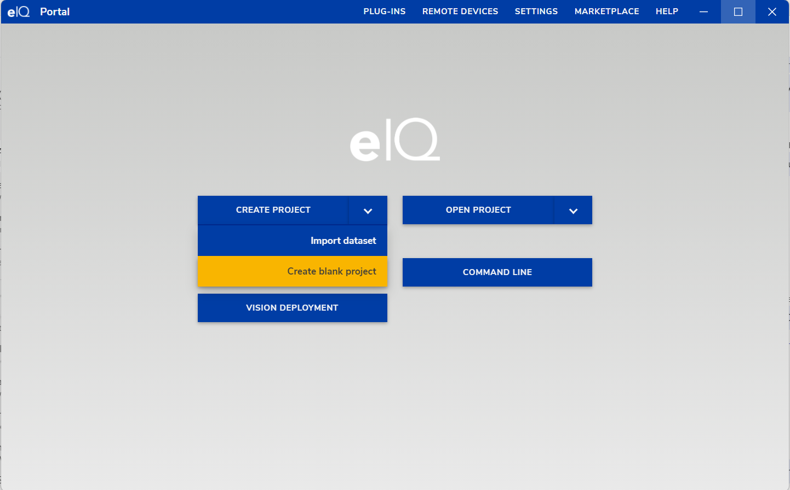
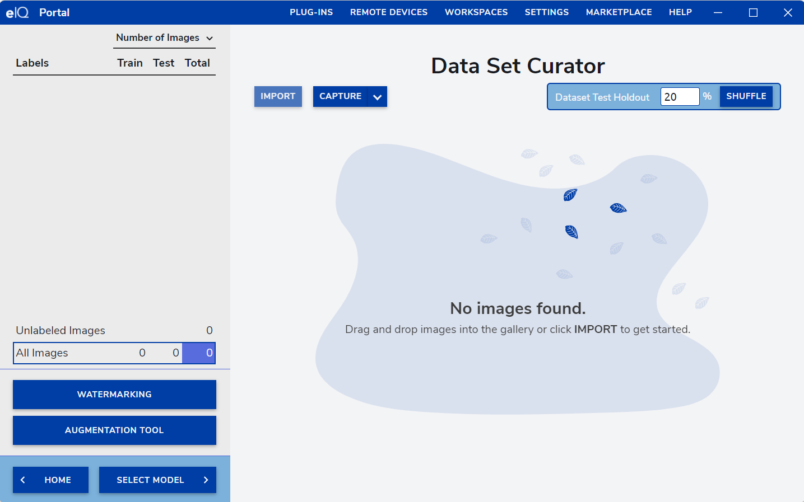
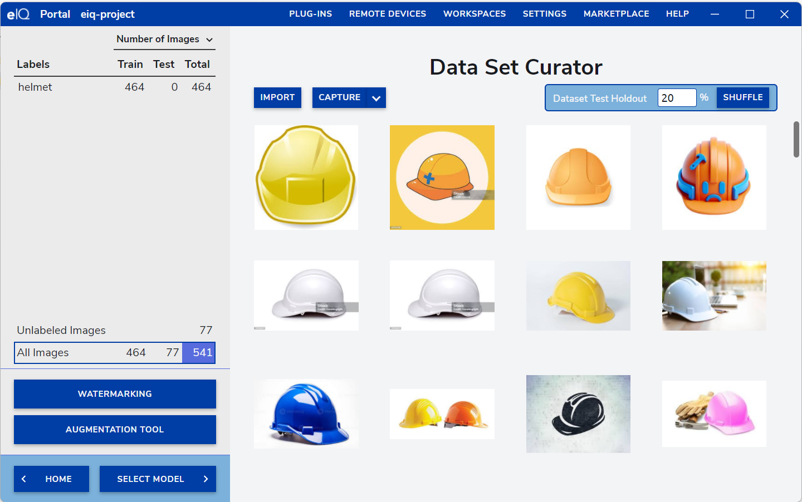
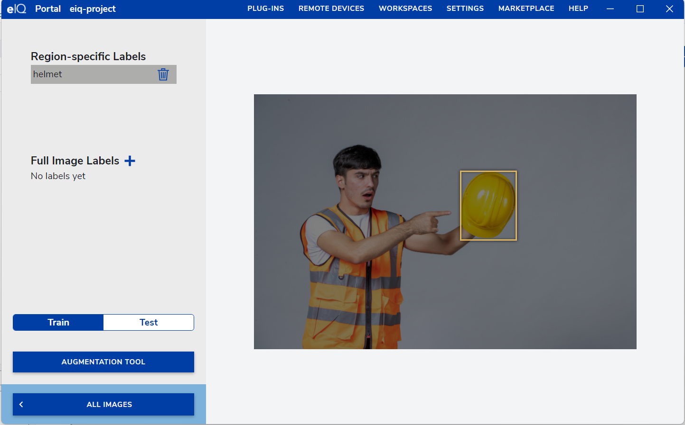
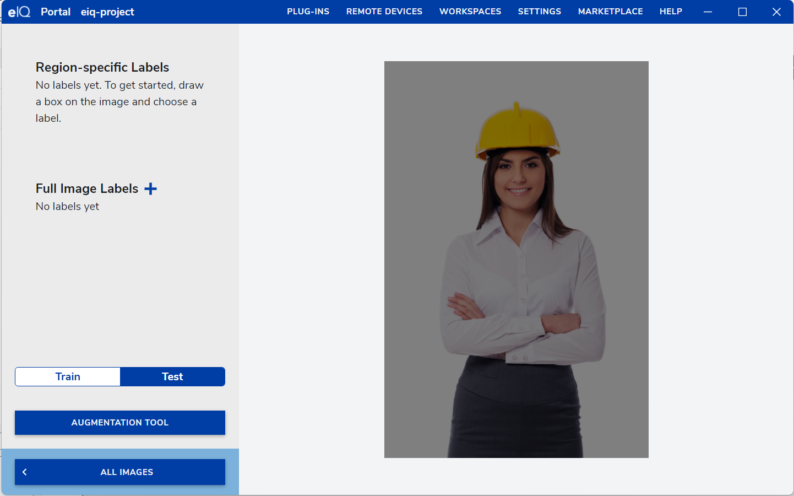
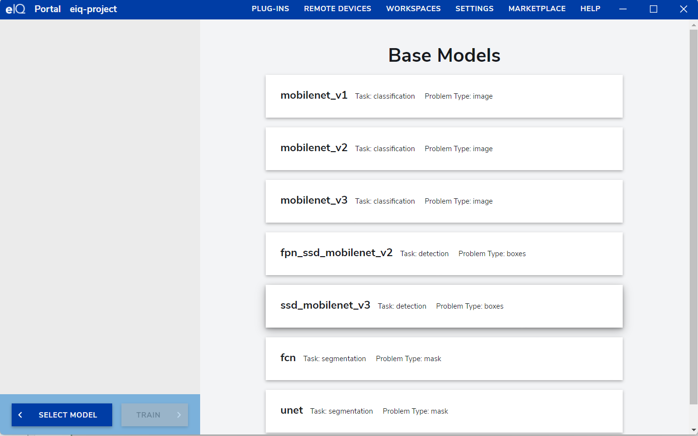
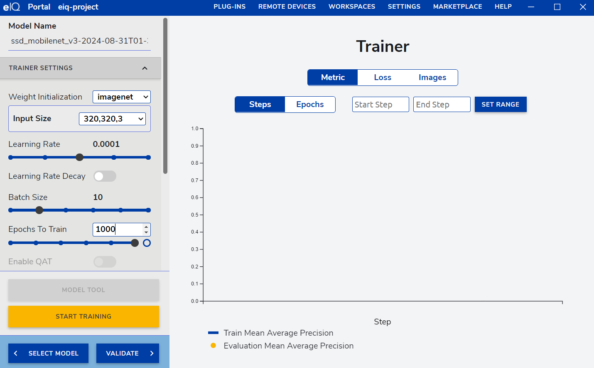
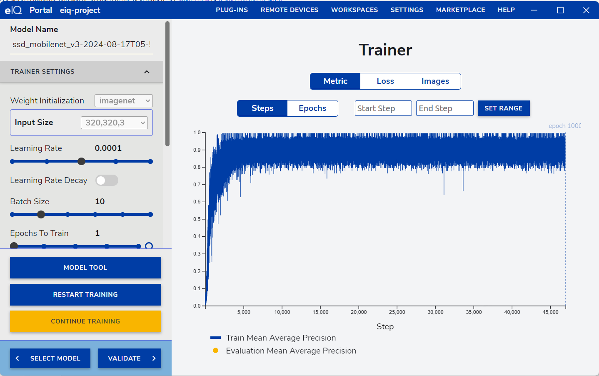
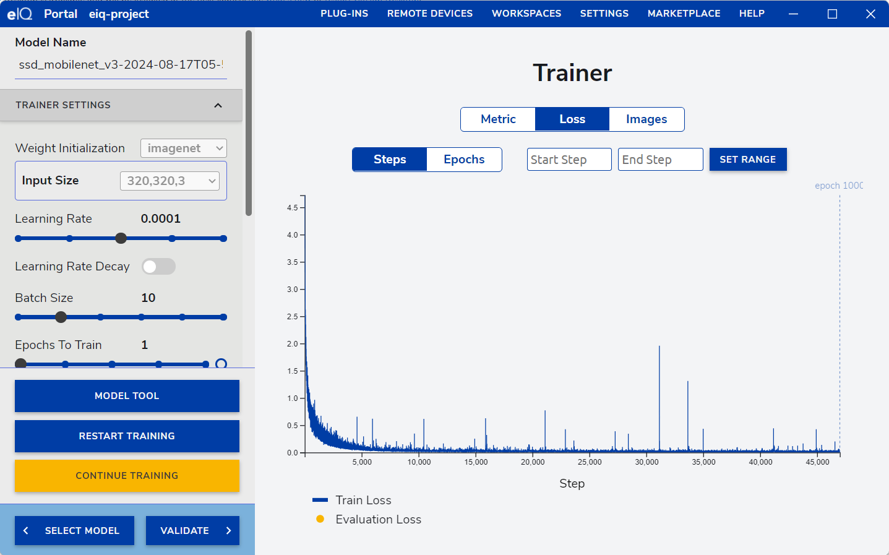
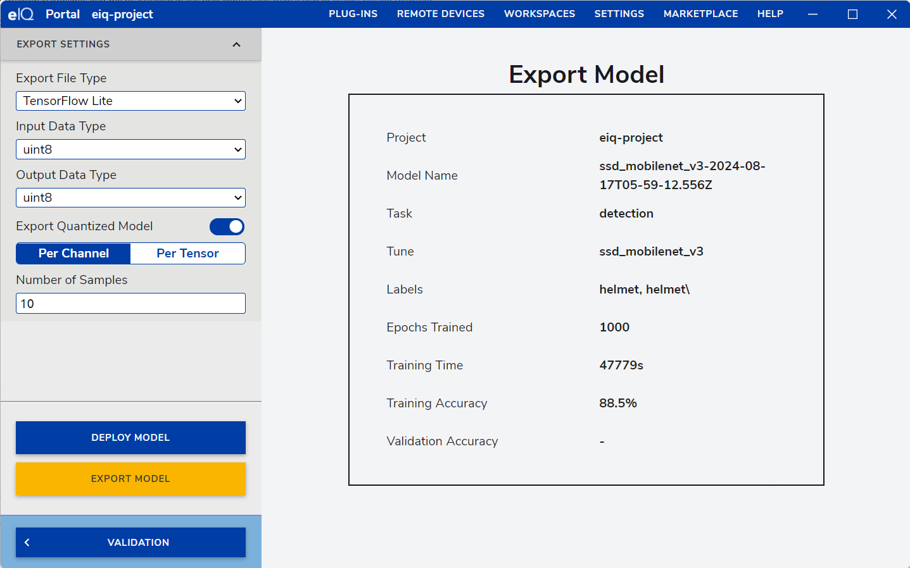

# Industrial Dress Code Detection
Simple AI demonstration model is created for detecting the Industrial Dress Code whether the person wore the helmet or not. Model creation is done using the NXP eiq toolkit. The eIQ Toolkit is a machine-learning software development environment that enables the use of ML algorithms on
NXP microcontrollers, microprocessors, and SoCs.

Create Project
--------------
New project can be created by using CREATE PROJECT -> Create blank project as below,

Import images
-------------
Images which is needed for creating the model can be imported using the import button.

Image Dataset
-------------
Here target is to detect the person wore the helmet or not, imported the images with helmet for the dataset.

Label for Training
------------------
All the imported images which will be used for training should be labeled. Here region specific labeling should be done for all the images as below,

Test Dataset
------------
Images which will be used for testing the model during training should be marked as test dataset as given below,

Select Model
------------
This demostration is detection type, chosen the base model as ssd_mobilenet_v3 Task: detection for training the model.

Training Configuration
----------------------
With the dataset creation, training a model needs to be done. Created a simple dataset with 464 Training Images and 77 Test images. Then training parameters are configured as below,

* Weight Initialization => imagenet
* input size => 320,320,3
* learning rate => 0.0001
* Batch size => 10
* Epochs to traing => 1000

Training Metrics
----------------
During and end of the training, model training metrics information can be seen as below,

Training Loss
----------------
During and end of the training, model training loss information can be seen as below,

Export Model
------------
On completion of training, model can be exported in following formats,

* Deepview RT
* ONNX
* Tensorflow Lite
* Kera

Here exporting a model in Tensorflow Lite model as below, 

Exported model can be used for detection application accordingly.